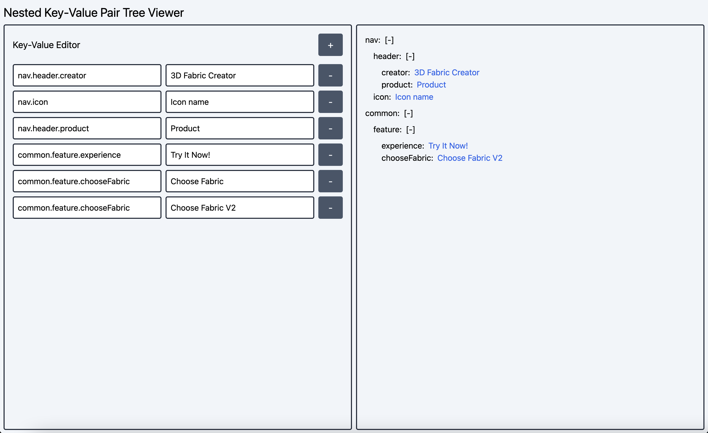

# Quiz 2 - Nested Key-Value Pair Tree Viewer

[Live Demo](https://raven-vue-quiz-2.netlify.app/)

## 如何執行專案

環境：

1. 建議在 macOS 12 底下進行開發、運行。
2. [node](https://nodejs.org/en/) version 使用 16.15.0，可以使用 [nvm](https://github.com/nvm-sh/nvm) 進行 node 各版本安裝和切換。

本機開發步驟：

1. `cd ./quiz-2`: 進入 quiz-2 專案目錄。
2. `npm install`: 安裝 npm 套件、相關依賴。
3. `npm run dev`: 使用 vite HMR 進型本機開發。
4. 在瀏覽器開啟 [localhost:3000/](http://localhost:3000/)，即可進行預覽、開發。

## 遇到的困難、問題，以及解決的方法

主要遇到的困難在於將左側輸入區的資料格式，轉換成右側預覽區可以使用的資料格式，並且要考量到一些 edge case，例如 key 值為 `.` 結尾（e.g. `nav.header.`）時，右側預覽區應該要不顯示該筆資料。

解決方法為使用 `split('.')` 切割 `nav.header.` 時，會得到 `['nav', 'header', '']`，若陣列結尾為空字串則過濾掉該筆資料。參考 App.vue 59 行。

## 如何部署專案

目前是透過 [Netlify](https://www.netlify.com/) 進行部署，當此 main branch 有新 commit、push 時便會自動觸發。
